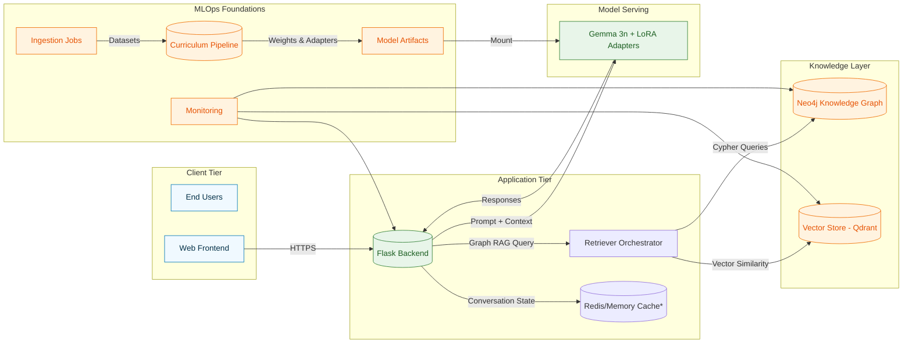
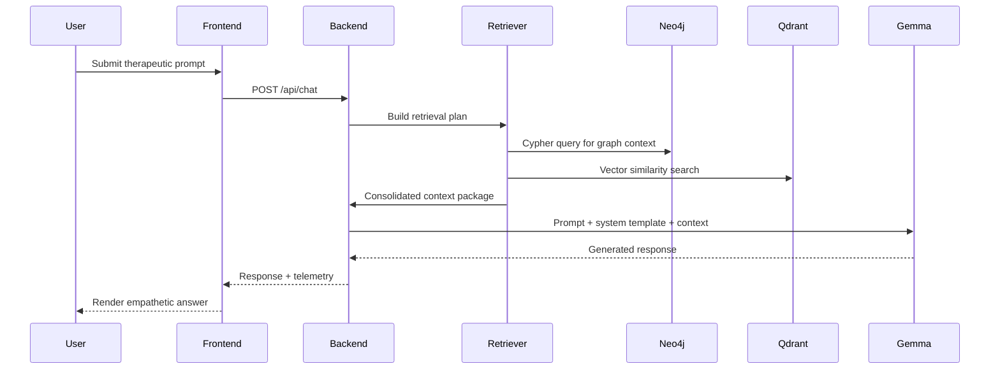

# Architecture Overview

This document summarises the Gemma 3n therapeutic chatbot platform, spanning data ingestion, curriculum fine-tuning, retrieval-augmented generation (RAG), and runtime serving. The goal is to provide a shared mental model for engineers, data scientists, and operations teams.

## High-Level Component Map

> \*Conversation history is maintained in-process today (`TherapeuticChatHandler`), but the diagram highlights an optional external cache for stateless scaling.

### Key Responsibilities

| Component | Responsibility | Implementation Notes |
| --- | --- | --- |
| Frontend | Presents chat UI, captures consent, proxies to API | Ships as static assets served by Nginx in the Docker stack. |
| Flask Backend (`Flask chat app/app.py`) | REST API, request validation, orchestration of retrieval + generation | Uses environment-driven paths for model assets and templates. |
| Retriever Orchestrator | Resolves hybrid Graph RAG queries, merges vector + graph context | Implemented in backend service; wrappers integrate with Neo4j and vector store clients. |
| Neo4j | Stores therapy domain knowledge graph, safety policies, and case lineage | APOC + GDS plugins enabled for traversals and analytics. |
| Vector Store | Provides dense embedding similarity search over counselling transcripts | Default deployment uses Qdrant; other providers can plug in via shared client interface. |
| Gemma 3n Model | Generates therapeutic responses conditioned on retrieved context | Fine-tuned via curriculum learning (LoRA adapters). |
| Curriculum Pipeline (`Curriculum Learning/src/`) | Data formatting, curriculum mixing, SFT/DPO fine-tuning orchestration | Supports sequential and adaptive curricula, W&B tracking, and adapter export. |
| Monitoring Stack | Logs, metrics, and alerts spanning app + data services | See [Monitoring & Alerting](operations/monitoring-alerting.md).

## Runtime Sequence

## Data Lifecycle

1. **Ingestion** – `DatasetManager` loads CounselChat and AnnoMI corpora, normalises conversations, and emits Hugging Face datasets.
2. **Curriculum Training** – `CurriculumTrainingManager` advances through phases, each with custom dataset mixes and learning rates. Outputs LoRA adapters and tokenizer assets.
3. **Evaluation** – `eval.py` computes NLG and therapy-specific metrics to gate releases.
4. **Artifact Promotion** – Approved adapters are versioned under `model-artifacts/` and mounted into the serving environment.
5. **Retrieval Curation** – Knowledge graph nodes and vector collections are refreshed in tandem with new model drops to keep retrieval content aligned.

## Deployment Topology

- **Local / Staging** – Use the provided [Docker Compose stack](deployment.md#docker-compose-stack) to run backend, Neo4j, Qdrant, and the Nginx frontend on a single host.
- **Production** – Recommended to migrate services to Kubernetes or a managed container platform. Neo4j Aura and Qdrant Cloud are drop-in replacements when connection strings and credentials are updated in environment variables.

## Security Considerations

- Backend enforces input sanitisation before forwarding to the model to mitigate prompt injection and PII leakage.
- Neo4j and Qdrant credentials are injected via `.env` and never hard-coded.
- LoRA adapters should be encrypted at rest; mount volumes read-only in production (already defaulted in Compose via `:ro`).
- All traffic between frontend and backend should terminate over HTTPS using a reverse proxy or cloud load balancer.

Refer to the [Safety & Compliance guidelines](safety-compliance.md) for policy-level obligations, including workflows for minors located in India.
