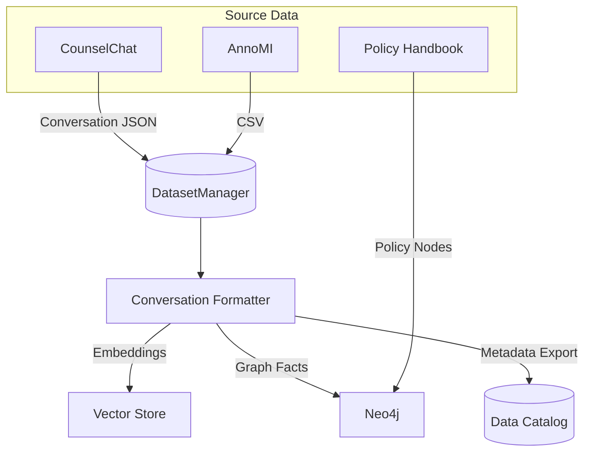
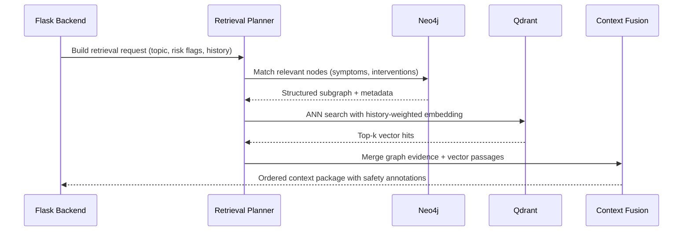

# Graph RAG Data Flow

This document details how the platform combines a Neo4j knowledge graph with a dense vector store to deliver context-aware therapeutic responses. The orchestration follows a hybrid retrieval pipeline that balances structural relationships (graph) with semantic similarity (vectors).

## Conceptual Model

- **Knowledge Graph (Neo4j):** Captures counsellor techniques, client scenarios, safety policies, and session lineage. Nodes commonly include `ClientProfile`, `Symptom`, `Intervention`, `Outcome`, and `Policy`. Relationships encode therapeutic progression (`ENGAGES_IN`, `ADDRESSES`, `RECOMMENDS`), enabling structured traversals and constraint checks.
- **Vector Store (Qdrant):** Holds embeddings of empathic exemplars, anonymised transcripts, and policy paragraphs for similarity search.
- **Retriever Orchestrator:** Combines graph traversals and ANN queries, merges evidence, scores relevance, and assembles a context bundle for the model.

## Ingestion Pipeline

1. **DatasetManager** validates conversations (role balance, content thresholds).
2. **Conversation Formatter** produces both SFT-ready text and structured metadata.
3. **Graph Loader** scripts translate metadata into Cypher upserts with version tags.
4. **Embedding Jobs** use the fine-tuned tokenizer to embed selected turns and push them into Qdrant collections (e.g. `therapeutic_examples`).

## Hybrid Retrieval at Runtime

### Ranking Strategy

1. **Graph Confidence Score** – Based on path depth, policy weighting, and recency.
2. **Semantic Similarity Score** – Cosine similarity between query embedding and stored vectors.
3. **Safety Boosts** – Policies addressing self-harm or minors receive priority.
4. **Diversity Check** – Deduplicate overlapping passages to keep prompts within token budget.

### Prompt Assembly

The backend concatenates, in order:

1. System prompt (`TherapeuticChatHandler.system_prompt`).
2. Latest user/assistant turns (respecting `max_length`).
3. Graph insights (converted to persuasive bullet points).
4. Vector snippets (high-similarity exemplars).
5. Guardrail reminder (e.g. mandatory escalation instructions for high-risk cases).

## Failure Handling

- **Neo4j Timeout:** Fallback to vector-only retrieval and log the incident to observability stack.
- **Empty Results:** Backend inserts a templated empathetic response instructing the user to seek immediate human help if risk is high.
- **Stale Data Detection:** Graph nodes and vector entries carry `version` fields. Runtime checks ensure mixed versions are not served together; otherwise, the backend triggers a cache refresh and surfaces a degraded-mode warning.

## Extending the Graph

- Use [setup/neo4j.md](setup/neo4j.md) to provision APOC and schema constraints.
- Data engineers can append ingestion notebooks or scripts under `Curriculum Learning/data_preprocessing` and update the Cypher ingestion templates referenced in [operations/ingestion-runbook.md](operations/ingestion-runbook.md).

Graph RAG is the backbone for contextual trustworthiness. Keep ingestion and retrieval modules aligned whenever the model is re-trained or new safety policies are issued.
